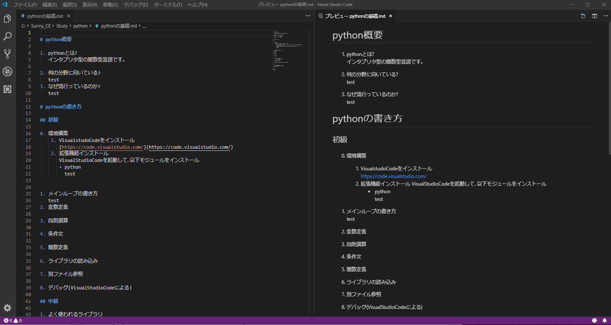
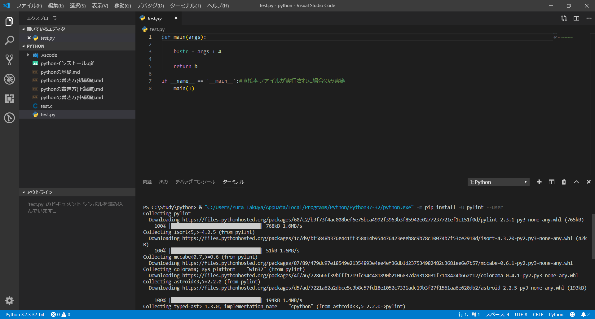

# python概要

1. pythonとは?  
   インタプリタ型の関数型言語です｡  
　　※インタプリタ:  
　　　ソースコードを一行ずつ読み込みコンピュータが実行できる命令に変換
    ※関数型言語:  
    　+ データと振る舞いが独立(オブジェクト指向のクラスの構造が共存しているイメージ例)
    　+ 外部に依存しない関数の入出力､内部で入力値に対する変更等の副作用を最小限に抑える

2. 何の分野に向いている?  
   大量のデータを扱う分野(ex データ解析)  
   マクロ操作

   ただし簡潔に処理が書けるだけで特別処理が速いわけではない
   ⇒速度を気にする場合は[Julia](https://julialang.org/)を使ってみよう!

# 環境構築  
    
  1. VisuaStudoCodeをインストール  
     [https://code.visualstudio.com/](https://code.visualstudio.com/)  

  2. python本体のインストール
    pythonのWebサイトよりpythonをインストールします。   
    [https://www.python.org/downloads/](https://www.python.org/downloads/)

  3. 拡張機能インストール
     + vscode拡張 python(発行者がMicrosoftのモジュールを入れましょう)  
       ※下記の画像は既にインストール済みとなっています
       

     + pylintインストール
       適当なpythonファイル(ここでは同根のtest.pyを開きます。)を作成しておいてvscodeで開いてみます。   
       右下にpylintのインストールの推奨アラートが出るので「install」をクリックします。
       以下の通り自動でインストールが実行されます。
       

  ※[Google Colaboratory](https://colab.research.google.com/)ならweb上でpythonが操作できます。   
  上記のセットアップなしで実行可能です。
